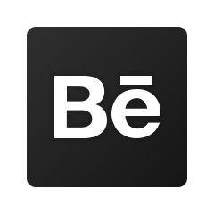
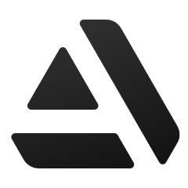

<!-- Custom Banner Designed by myself -->

<!-- Dark mode banner (shows only in dark mode) -->

<!-- Light mode banner (shows only in light mode) -->

  <b><code>VC_3DStyle (3D Designer/Game Designer/Graphic Designer)</code></b>

---

  <b>Starting a new journey in Computer Science.</b>

---
<!-- Custom Icon Designed by myself -->
##  Let’s link up

---
<!-- Custom Icon Designed by myself -->
##  Languages and Tools

<!-- All Dark mode card -->

<!-- All Light mode card -->

<!-- Credits to img.shield.io for the badge -->

---
<!-- Custom Icon Designed by myself -->
##  GitHub Stats

<!-- Dark mode card -->

<!-- Light mode card -->

<!-- Credits to GitHub Readme Stats for the stats panels-->